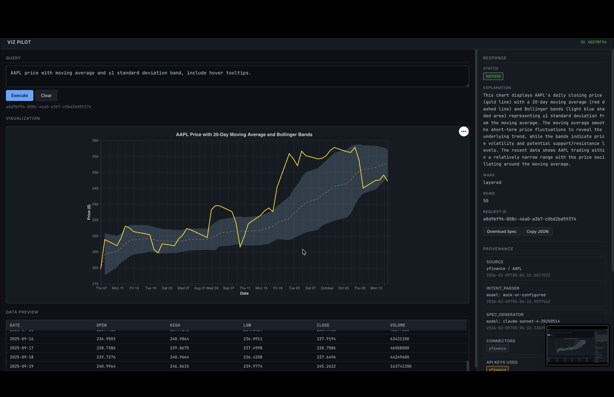

# Viz Pilot

**An autonomous visualization agent that transforms plain-English chart requests into auditable, institutional-grade Vega-Lite specifications -- with planning, tool use, self-correction, and full provenance tracking.**

[](https://terminal-x-drab.vercel.app)
[]()
[]()
[]()

---

## Demo



*AAPL closing price with 20-day moving average and Bollinger Bands -- generated from a single sentence prompt with interactive tooltips, brush zoom, and full provenance metadata.*

---

## High-Level Overview

### The Problem

Turning data into a meaningful chart today requires you to know a visualization grammar (Vega-Lite, D3, Matplotlib), write data-fetching code, handle edge cases (missing data, outliers, too many points), and manually verify the output is correct and safe. This is slow, error-prone, and inaccessible to non-technical users.

### Why an Agentic Approach

A simple "LLM + template" approach breaks down quickly:
- LLMs hallucinate field names and produce syntactically invalid specs
- Raw data needs quality checks before visualization
- Security sanitization is needed (LLMs can inject scripts)
- Users give ambiguous prompts that need clarification
- Charts need iteration -- a single LLM call rarely produces a perfect result

Viz Pilot solves this with a **multi-step agent loop**: it plans what to do, selects tools, executes actions, validates results, and self-corrects -- producing auditable output with a full provenance trail.

### What Makes This Different

| Simple LLM App | Viz Pilot Agent |
|----------------|-----------------|
| Single prompt-to-output call | 6-stage pipeline with planning, execution, and reflection |
| No data fetching | Live market data via connectors (yfinance) |
| No validation | Hardened validator with regex-based security scanning |
| No error recovery | Self-correcting retry loop with LLM feedback |
| No audit trail | Full provenance: sources, transforms, model versions, validation |
| No quality checks | Automatic NaN/outlier detection with one-click autofix |
| No clarification | Human-in-the-loop clarification for ambiguous prompts |

---

## Key Features

- **Autonomous Goal Planning** -- LLM-powered intent parser decomposes natural language into structured tasks (chart type, symbol, metrics, transforms, filters)
- **Tool Use** -- Selects and invokes data connectors (yfinance), transform engines (moving average, resample, rebase), and validation tools automatically
- **Self-Correction** -- When the validator rejects a spec, the agent feeds errors back to the LLM and retries with full context
- **Memory & Persistence** -- Every request, response, and provenance record is persisted to a database for replay and audit
- **Multi-Step Reasoning** -- 6-stage pipeline: intent parsing, data fetching, quality checks, normalization, spec generation, and validation
- **Human-in-the-Loop** -- Ambiguous prompts trigger a clarification flow; the frontend displays the question and waits for user input
- **Security Hardened** -- Regex-based dangerous pattern detection (XSS, eval, script injection), forbidden key stripping, data URI scrubbing
- **Multi-LLM Support** -- Anthropic Claude and OpenAI GPT with auto-detection and seamless provider switching
- **Interactive Charts** -- Brush/zoom, clickable legends, tooltips, layered time series with Bollinger Bands
- **Full Observability** -- Prometheus metrics, structured JSON logging, optional Sentry error tracking, Grafana dashboards

---

## Agent Architecture

```
                          +------------------+
                          |   User Prompt    |
                          +--------+---------+
                                   |
                          +--------v---------+
                          |  INTENT PARSER   |  <-- LLM (Claude/GPT)
                          |  (Planner)       |  Decomposes goal into
                          |                  |  structured TASK JSON
                          +----+-------+-----+
                               |       |
                     +---------+       +--------+
                     |                          |
              +------v------+          +--------v--------+
              | Clarify?    |          | DATA CONNECTOR   |  <-- Tool: yfinance
              | (Human-in-  |          | (Executor)       |  Fetches real market
              |  the-Loop)  |          |                  |  data from APIs
              +------+------+          +--------+---------+
                     |                          |
                     |                 +--------v---------+
                     |                 | QUALITY ENGINE   |  <-- Tool: Quality Checker
                     |                 | (Evaluator)      |  NaN, outliers, row
                     |                 |                  |  limits, autofix
                     |                 +--------+---------+
                     |                          |
                     |                 +--------v---------+
                     |                 | NORMALIZER       |  <-- Tool: Transform Engine
                     |                 | (Executor)       |  moving_average, resample,
                     |                 |                  |  pct_change, rebase
                     |                 +--------+---------+
                     |                          |
                     |                 +--------v---------+
                     |                 | SPEC GENERATOR   |  <-- LLM (Claude/GPT)
                     |                 | (Executor)       |  Generates Vega-Lite
                     |                 |                  |  JSON spec
                     |                 +--------+---------+
                     |                          |
                     |                 +--------v---------+
                     |                 | VALIDATOR        |  <-- Tool: Security + Schema
                     |                 | (Critic)         |  Sanitization, schema check,
                     |                 |                  |  field validation
                     |                 +---+----------+---+
                     |                     |          |
                     |              +------v---+  +---v------+
                     |              | PASS     |  | FAIL     |
                     |              | Return   |  | Retry w/ |
                     |              | response |  | feedback |
                     |              +------+---+  +---+------+
                     |                     |          |
                     |                     |    (back to Spec Generator
                     |                     |     with error context)
                     |                     |
                     |              +------v---------+
                     |              | PERSIST & RESPOND |
                     |              | (Controller)      |  Save to DB,
                     |              |                   |  build provenance,
                     |              |                   |  return to user
                     +------------->+-------------------+
```

### Component Roles

| Component | Role | Description |
|-----------|------|-------------|
| **Intent Parser** | Planner | Decomposes natural language into structured task (goal, chart type, symbol, transforms) |
| **Data Connector** | Executor (Tool) | Fetches live data from APIs (yfinance) based on the plan |
| **Quality Engine** | Evaluator | Checks data integrity (NaN, outliers, row limits) and applies autofix |
| **Normalizer** | Executor (Tool) | Applies deterministic transforms (moving average, resample, rebase, pct change) |
| **Spec Generator** | Executor | LLM generates Vega-Lite JSON spec with institutional-grade defaults |
| **Validator** | Critic | Validates spec (schema, security, fields) and provides error feedback for retry |
| **Orchestrator** | Controller | Manages the loop: plan -> execute -> observe -> reflect -> retry or terminate |
| **Database** | Memory | Persists every request/response/provenance for audit and replay |

---

## Agent Loop (Core Logic)

```
1. RECEIVE GOAL
   User submits a natural language prompt
   Example: "AAPL price with moving average and 1 standard deviation band"

2. PLAN ACTIONS
   Intent Parser (LLM) decomposes into structured task:
   {goal, chart_type: "line", symbol: "AAPL", metrics: ["Close"],
    transforms: [{op: "moving_average", window: 20}]}

   If ambiguous -> ask clarification question, WAIT for user

3. SELECT TOOLS
   Orchestrator selects: yfinance connector (data), normalizer (transforms)

4. EXECUTE ACTIONS
   a. Fetch 6 months of AAPL data via yfinance
   b. Run quality checks (NaN ratio, outlier detection, row count)
   c. Apply transforms (moving_average_20)
   d. Generate Vega-Lite spec via LLM

5. OBSERVE RESULTS
   Validator checks the generated spec:
   - Schema valid? Required keys present?
   - Fields exist in data? Encoding correct?
   - Security clean? No script injection?

6. REFLECT / REVISE
   If validator rejects: feed errors back to LLM
   "Your spec failed: field 'parsed_date' not in data. Available: [date, Close, Volume]"
   LLM regenerates with corrected field names (max 1 retry)

7. TERMINATE OR CONTINUE
   - If valid: persist to DB, return spec + data + explanation + provenance
   - If still invalid after retry: return error with details
```

---

## Tools & Capabilities

### Available Tools

| Tool | Type | Description |
|------|------|-------------|
| **yfinance Connector** | Data API | Fetches live stock market data (OHLCV) for any ticker |
| **Normalizer** | Transform Engine | `moving_average`, `rebased_index`, `resample`, `pct_change` |
| **Quality Checker** | Data Validator | NaN detection, IQR-based outlier detection, row count limits |
| **Autofix Engine** | Data Repair | Decimation (every k-th row), monthly aggregation |
| **Vega-Lite Validator** | Spec Validator | Schema check, security scan, field validation |
| **SQLite/PostgreSQL** | Persistence | Request/response/provenance storage |
| **Prometheus** | Metrics | 8 metric families tracking agent performance |

### Tool Selection Strategy

The orchestrator selects tools based on the parsed intent:
- **symbol present** -> yfinance connector
- **transforms requested** -> normalizer (moving_average, resample, etc.)
- **row count > 5000** -> autofix engine (decimation or aggregation)
- **all requests** -> validator (always runs), quality checker (always runs)

### Failure Handling

| Failure | Response |
|---------|----------|
| Connector returns no data | `E_NO_DATA` error with symbol context |
| Quality check fails | `E_BAD_DATA` with metrics (NaN ratios, outlier counts) |
| LLM returns invalid JSON | Retry once with error context |
| Validator rejects spec | Retry with validator errors fed to LLM |
| Both retries fail | `E_VEGA_INVALID` with detailed validation errors |
| Rate limit exceeded | `E_RATE_LIMIT` with `Retry-After: 60` header |
| DB write fails | Graceful degradation (response still returned) |

---

## Memory Design

### Short-Term Memory (Context Window)

- **Intent Parser**: Receives the full user prompt + system instructions
- **Spec Generator**: Receives the parsed task + data schema + 10-row data preview + derived fields + available connectors
- **Retry Context**: On validation failure, validator errors are injected into the next LLM prompt

### Long-Term Memory (Database)

Every request is persisted as a `RequestRecord`:

```
+----+------------------+------------------------+----------+-----------+
| id | request_id (UUID)| prompt                 | status   | timestamp |
+----+------------------+------------------------+----------+-----------+
| 1  | a7b3c...         | "Plot AAPL daily..."   | success  | 2026-02.. |
| 2  | d4e5f...         | "TSLA volume bars"     | error    | 2026-02.. |
+----+------------------+------------------------+----------+-----------+
| response_json (full API response)                                     |
| provenance_json (sources, transforms, llm_calls, validator)           |
+-----------------------------------------------------------------------+
```

### What Gets Stored

- Full user prompt
- Status (success / error / clarify_needed)
- Complete API response (spec, data preview, explanation)
- Provenance: data sources, LLM model + response IDs, transforms applied, validation results

### Retrieval Strategy

- **Replay**: `GET /api/viz/history/{request_id}` fetches the full record
- **Re-execution**: `POST /api/viz/replay` re-runs the pipeline with optional overrides (different model, modified prompt)
- **Audit Trail**: `parent_request_id` links replayed requests to their originals

### Privacy Considerations

- No user data stored beyond the prompt and response
- API keys are never logged or persisted
- Database is local SQLite by default (no cloud transmission)
- LLM calls use API keys from env vars (never embedded in code)

---

## Models Used

| Model | Provider | Role | Why |
|-------|----------|------|-----|
| `claude-sonnet-4-20250514` | Anthropic | Intent parsing, spec generation | Strong structured output, follows system prompts precisely, excellent at Vega-Lite |
| `gpt-4o-mini` | OpenAI | Intent parsing, spec generation (fallback) | Fast, cost-effective, good JSON output |

### Model Selection

- **Auto-detection**: If `ANTHROPIC_API_KEY` is set, uses Claude. If `OPENAI_API_KEY`, uses GPT.
- **Explicit override**: `LLM_PROVIDER=anthropic` or `LLM_PROVIDER=openai`
- **Per-task override**: `SPEC_LLM_MODEL` and `INTENT_LLM_MODEL` for fine-grained control
- **Mock mode**: Deterministic responses for development and testing (no API calls)

### Why These Models

- **Claude Sonnet**: Excels at following complex system prompts (layered specs, interactivity rules, provenance metadata). Rarely hallucinates field names.
- **GPT-4o-mini**: 10x cheaper, acceptable quality for simple charts. Good fallback when Anthropic is unavailable.

---

## Installation

### System Requirements

- Python 3.9+ (3.12 recommended for Vercel deployment)
- Node.js 18+ (only for Vercel CLI deployment)
- No GPU required

### Setup

```bash
git clone https://github.com/yourusername/viz-pilot.git
cd viz-pilot
python3 -m venv .venv
source .venv/bin/activate
pip install -r requirements.txt
```

### Environment Variables

Create a `.env` file in the project root:

```env
# LLM Configuration
MOCK_OPENAI=false              # Set to true for mock mode (no API keys needed)
MOCK_SPEC_GENERATOR=false
ANTHROPIC_API_KEY=sk-ant-...   # For Claude
OPENAI_API_KEY=sk-...          # For GPT (optional if using Claude)
LLM_PROVIDER=anthropic         # Optional: force provider

# Auth (disable for development)
MOCK_AUTH=true

# Database
DATABASE_URL=sqlite:///./viz_agent.db   # Default; use PostgreSQL for production

# Monitoring
PROMETHEUS_ENABLED=true
LOG_AS_JSON=true
LOG_LEVEL=INFO
```

---

## Usage

### Basic Usage

```bash
# Start the server (mock mode -- no API keys needed)
python3 -m uvicorn backend.app:app --host 127.0.0.1 --port 8000 --reload
```

Open [http://127.0.0.1:8000/frontend/index.html](http://127.0.0.1:8000/frontend/index.html)

### Example Prompts

| Prompt | What It Generates |
|--------|------------------|
| `"Plot AAPL daily close since 2024-01-01"` | Simple line chart with AAPL closing prices |
| `"TSLA with 30-day moving average"` | Layered chart: daily close + smoothed MA line |
| `"AAPL price with moving average and 1 standard deviation band"` | Multi-layer: close + MA + Bollinger Bands |
| `"Compare AAPL and MSFT year-to-date"` | Rebased index chart (both starting at 100) |
| `"TSLA volume as bar chart"` | Bar chart with daily volume |

### curl Example

```bash
curl -s -X POST http://127.0.0.1:8000/api/viz \
  -H "Content-Type: application/json" \
  -d '{"prompt":"Plot TSLA daily close with 30-day moving average"}' | python3 -m json.tool
```

### Advanced: Replay with Different Model

```bash
curl -s -X POST http://127.0.0.1:8000/api/viz/replay \
  -H "Content-Type: application/json" \
  -d '{"request_id":"<uuid-from-previous>","model_override":"gpt-4o"}' | python3 -m json.tool
```

### Advanced: Autofix with Transforms

```bash
curl -s -X POST http://127.0.0.1:8000/api/viz/autofix \
  -H "Content-Type: application/json" \
  -d '{
    "prompt": "AAPL daily close last 2 years",
    "transforms": [{"op": "moving_average", "field": "Close", "window": 50}],
    "autofix": {"method": "decimate"}
  }' | python3 -m json.tool
```

---

## Configuration

### Agent Parameters

| Parameter | Default | Description |
|-----------|---------|-------------|
| `preview_rows` | `50` | Max rows sent to LLM for spec generation |
| `max_render_rows` | `5000` | Hard limit for inline data in Vega-Lite spec |
| `temperature` | `0.0` | LLM temperature (deterministic output) |
| `max_tokens` | `4096` | Max LLM response tokens |
| `max_retries` | `1` | Spec generation retries on validation failure |

### Tool Permissions

| Tool | Always Runs | Conditionally Runs |
|------|-------------|-------------------|
| Intent Parser | Yes | -- |
| Validator | Yes | -- |
| Quality Checker | Yes | -- |
| yfinance Connector | -- | When `symbol` is in task |
| Normalizer | -- | When `transforms` are requested |
| Autofix Engine | -- | When quality check fails or explicitly requested |

### Memory Limits

| Limit | Value | Description |
|-------|-------|-------------|
| Data preview to LLM | 10 rows | Prevents context overflow |
| Data preview to frontend | 50 rows | Performance limit |
| Inline data in spec | 5000 rows | Vega-Lite rendering limit |
| DB record size | Unlimited | Full response JSON stored |

### Safety Settings

| Setting | Value | Description |
|---------|-------|-------------|
| `RATE_LIMIT_PER_MINUTE` | `60` | Max API requests per key per minute |
| `max_nan_ratio` | `0.2` | Max allowed NaN ratio per column |
| `outlier_iqr_multiplier` | `3.0` | IQR multiplier for outlier detection |
| Forbidden Vega keys | `usermeta`, `signals` | Stripped from all specs |
| Dangerous patterns | 9 regex rules | Script, eval, proto injection detection |

---

## Evaluation & Metrics

### Prometheus Metrics (8 Families)

| Metric | Type | What It Measures |
|--------|------|-----------------|
| `viz_requests_total` | Counter | Total requests by endpoint/method/status |
| `viz_intent_parse_total` | Counter | Intent parse outcomes (success/fail/clarify) |
| `viz_spec_gen_total` | Counter | Spec generation outcomes |
| `viz_spec_validation_failures_total` | Counter | Validation errors by reason |
| `viz_data_quality_errors_total` | Counter | Quality check failures by error code |
| `viz_transforms_applied_total` | Counter | Which transforms are used |
| `viz_request_latency_seconds` | Histogram | End-to-end request latency |
| `viz_spec_gen_latency_seconds` | Histogram | LLM spec generation time |

### Success/Failure Criteria

- **Success**: Valid Vega-Lite spec + data preview + explanation returned
- **Clarification**: Ambiguous prompt identified, question returned to user
- **Failure**: Error code returned with details (E_INTENT_PARSE_FAIL, E_NO_DATA, E_VEGA_INVALID, etc.)

### Known Limitations

- yfinance connector only (no FRED, no custom CSV upload yet)
- Single retry on validation failure (could benefit from 2-3 retries)
- In-memory rate limiter doesn't share state across serverless instances
- SQLite is ephemeral on Vercel (use PostgreSQL for production persistence)
- Cold starts on Vercel take 3-8 seconds (pandas/numpy loading)

---

## Safety & Guardrails

### Prompt Constraints

- System prompt enforces strict JSON-only output (no prose in LLM responses)
- Intent parser validates against a fixed JSON schema
- Spec generator has explicit rules: no secrets, fail safely, institutional standards

### Security Sanitization (9 Regex Rules)

```
function\s*\(     -- Blocks JavaScript function definitions
<\s*script        -- Blocks script tag injection
eval\s*\(         -- Blocks eval execution
window\.          -- Blocks window object access
document\.        -- Blocks DOM manipulation
__proto__         -- Blocks prototype pollution
constructor\s*\(  -- Blocks constructor hijacking
data:\s*image\/   -- Blocks data URI injection
javascript\s*:    -- Blocks JS URL schemes
```

### Tool Access Limits

- Data connectors limited to public market data (yfinance)
- No file system access from LLM-generated specs
- No network calls from rendered Vega-Lite specs
- `usermeta` and `signals` keys stripped (potential command injection vectors)

### Cost Controls

- Rate limiting: 60 requests/minute per API key (configurable)
- LLM calls: max 4096 tokens per response
- Temperature 0.0: deterministic, no creative exploration
- Max 1 retry: limits LLM call cost to 2x per request

### Human Approval Points

- Clarification flow: agent asks before proceeding on ambiguous prompts
- Autofix buttons: user explicitly triggers data repair (not automatic)
- No automatic external API calls beyond the user's stated intent

### Failure Modes & Mitigations

| Failure Mode | Mitigation |
|-------------|------------|
| LLM hallucinates field names | Validator checks fields against data preview |
| LLM generates malicious spec | 9 regex patterns + forbidden key stripping |
| Data connector timeout | Error response with `E_NO_DATA` |
| Database write failure | Graceful degradation (response still returned) |
| Rate limit exceeded | 429 response with `Retry-After` header |
| LLM API down | Mock mode fallback for development |

---

## Ethics & Responsible Use

### Intended Use Cases

- Financial data visualization and exploration
- Rapid prototyping of data charts for analysis
- Educational tool for learning Vega-Lite specification
- Internal dashboards for market data review

### Prohibited Uses

- Automated trading based on generated charts
- Generating misleading or manipulated visualizations
- Scraping or redistributing yfinance data beyond their ToS
- Using the agent to generate executable code (specs are data-only JSON)

### Bias & Risk Considerations

- LLMs may reflect biases in financial data interpretation
- Default chart types may emphasize certain patterns over others
- yfinance data has its own accuracy and availability limitations
- Generated explanations are AI-produced and should not be treated as financial advice

### Transparency Commitments

- Every response includes full provenance (data source, LLM model, version)
- Validation results are always visible (errors, warnings, sanitization actions)
- No hidden processing -- all transforms and quality fixes are logged
- Open source: all code is auditable

---

## Project Structure

```
viz-pilot/
|
|-- api/
|   |-- index.py                    # Vercel serverless adapter
|
|-- backend/
|   |-- app.py                      # FastAPI entry point + middleware
|   |-- orchestrator.py             # Agent loop controller (plan/execute/reflect)
|   |-- validator.py                # Vega-Lite spec validation & security sanitization
|   |-- quality.py                  # Data quality checks & autofix engine
|   |-- llm_wrapper.py             # Multi-LLM abstraction (Claude + GPT)
|   |-- auth.py                     # API key auth & rate limiting
|   |-- db.py                       # SQLAlchemy persistence layer
|   |-- models.py                   # RequestRecord ORM model
|   |-- monitoring.py               # Prometheus metrics + structured logging
|   |-- schemas.py                  # Pydantic data models
|   |-- processors/
|   |   |-- intent_parser.py        # NL prompt -> structured task (Planner)
|   |   |-- spec_generator.py       # Task + data -> Vega-Lite spec (Executor)
|   |   |-- normalizer.py          # Data transforms (moving_average, resample, etc.)
|   |-- connectors/
|       |-- yfinance_connector.py   # Yahoo Finance data fetcher (Tool)
|
|-- frontend/
|   |-- index.html                  # Dark-mode UI with Vega-Embed
|
|-- public/
|   |-- index.html                  # Static copy for Vercel deployment
|
|-- schemas/
|   |-- intent_task_schema.json     # Task JSON schema
|   |-- spec_generator_response_schema.json  # LLM output schema
|   |-- provenance_schema.json      # Provenance metadata schema
|   |-- vega_allowed.json           # Allowed marks, keys, limits
|   |-- time_series_schema.json     # Data column/row schema
|
|-- tests/                          # 58 tests across 16 files
|-- chart/                          # Helm chart for Kubernetes
|-- k8s/                            # Kubernetes manifests
|-- grafana/                        # Grafana dashboards & provisioning
|-- prometheus/                     # Prometheus scrape config
|-- .github/workflows/              # CI (pytest) + CD (K8s deploy)
|
|-- Dockerfile
|-- docker-compose.yml              # App + Prometheus + Grafana
|-- vercel.json                     # Vercel serverless config
|-- requirements.txt
|-- .env.example
```

---

## Deployment

### Vercel (Live)

Deployed as a Python serverless function + static frontend:

```bash
npm install -g vercel
vercel login
vercel --prod
```

Set environment variables via `vercel env add ANTHROPIC_API_KEY`, etc.

### Docker

```bash
docker-compose up --build
# App:        http://localhost:8000
# Prometheus: http://localhost:9090
# Grafana:    http://localhost:3000 (admin/admin)
```

### Kubernetes

```bash
helm install viz-pilot chart/viz-agent/
# Includes: Deployment, Service, Ingress, HPA (2-10 replicas)
```

### GitHub Actions CI/CD

- **ci.yml**: Runs pytest on every push/PR
- **deploy-k8s.yml**: Builds Docker image, pushes to GHCR, deploys via Helm

---

## Roadmap

### Planned Features

- [ ] FRED connector for macroeconomic data (CPI, GDP, unemployment)
- [ ] CSV upload connector for custom datasets
- [ ] Multi-ticker comparison in a single chart
- [ ] Forecasting overlay (simple moving projection)
- [ ] A/B testing framework for spec generation quality
- [ ] OpenTelemetry distributed tracing
- [ ] WebSocket streaming for real-time chart updates

### Known Gaps

- Single retry limit (2-3 retries would improve success rate)
- No caching layer for repeated yfinance queries
- Frontend is a single HTML file (no component framework)
- No user accounts or session management

### Future Research Directions

- Fine-tuned models for financial visualization grammar
- Multi-agent collaboration (researcher + chart designer + critic)
- Natural language chart editing ("make the bands wider", "change to log scale")
- Voice input for chart requests

---

## Contributing

### How to Contribute

1. Fork the repository
2. Create a feature branch (`git checkout -b feature/amazing-feature`)
3. Make your changes
4. Run the test suite: `python3 -m pytest tests/ -v`
5. Commit your changes (`git commit -m 'Add amazing feature'`)
6. Push to the branch (`git push origin feature/amazing-feature`)
7. Open a Pull Request

### Coding Standards

- Python code follows PEP 8
- All new features must include tests
- Use `monkeypatch` for mocking (not `unittest.mock.patch` decorators)
- Graceful degradation: optional imports wrapped in try/except
- DB errors should never crash the API

### Issue & PR Process

- Use GitHub Issues for bugs and feature requests
- PRs should reference the relevant issue
- All PRs must pass CI (58 tests) before merge

---

## Testing

```bash
python3 -m pytest tests/ -v
```

**58 tests across 16 test files**, covering:

| Test File | What It Tests |
|-----------|--------------|
| `test_intent_parser.py` | Intent parsing + clarification flows |
| `test_spec_generator_llm.py` | Spec generation, retry logic, format normalization |
| `test_spec_validator.py` | Vega-Lite grammar validation |
| `test_validator_hardening.py` | Security sanitization (XSS, eval, iframe, data URI) |
| `test_quality.py` | NaN detection, outliers, decimation, monthly aggregation |
| `test_normalizer.py` | Moving average, resample, pct_change, rebase transforms |
| `test_auth_rate_limit.py` | API key auth, fixed-window rate limiter |
| `test_persistence.py` | DB save/retrieve/reconfigure |
| `test_replay_endpoint.py` | Replay with parent_request_id |
| `test_autofix_endpoint.py` | Autofix with explicit transforms |
| `test_end_to_end_orchestrator.py` | Full agent pipeline integration |
| `test_api_viz_endpoint.py` | HTTP endpoint integration |
| `test_metrics_endpoint.py` | Prometheus /metrics endpoint |
| `test_model_versioning_capture.py` | LLM model + response_id tracking |
| `test_replay_with_model_version.py` | Replay with model override |
| `test_yfinance_connector.py` | Data connector (monkeypatched) |

All tests use mocks -- no API keys required.

---

## Tech Stack

| Layer | Technology |
|-------|-----------|
| **Backend** | Python, FastAPI, SQLAlchemy, Pydantic v2 |
| **LLMs** | Anthropic Claude Sonnet, OpenAI GPT-4o-mini |
| **Data** | yfinance, pandas, NumPy |
| **Frontend** | Vanilla JS, Vega-Lite v5, Vega-Embed v6 |
| **Monitoring** | Prometheus, Grafana, Sentry, structured JSON logging |
| **Deployment** | Vercel (serverless), Docker, Kubernetes (Helm) |
| **CI/CD** | GitHub Actions (pytest + Docker build + K8s deploy) |
| **Testing** | pytest (58 tests, 16 files) |

---

## License

MIT License. See [LICENSE](LICENSE) for details.

Third-party licenses:
- [Vega-Lite](https://vega.github.io/vega-lite/) -- BSD-3-Clause
- [yfinance](https://github.com/ranaroussi/yfinance) -- Apache 2.0
- [FastAPI](https://fastapi.tiangolo.com/) -- MIT

---

## Citation

If you use this project in research or publications:

```bibtex
@software{viz_pilot_2026,
  title     = {Viz Pilot: An Autonomous Visualization Agent},
  author    = {Sudhire Rahul},
  year      = {2026},
  url       = {https://github.com/yourusername/viz-pilot},
  note      = {An agentic AI system for natural language to Vega-Lite visualization}
}
```

---

## Acknowledgments

### Frameworks & Libraries

- [FastAPI](https://fastapi.tiangolo.com/) -- High-performance Python web framework
- [Vega-Lite](https://vega.github.io/vega-lite/) -- Grammar of interactive graphics
- [Anthropic Claude](https://www.anthropic.com/) -- LLM for structured output generation
- [OpenAI](https://openai.com/) -- LLM fallback provider
- [yfinance](https://github.com/ranaroussi/yfinance) -- Yahoo Finance market data
- [Prometheus](https://prometheus.io/) -- Metrics and monitoring
- [Grafana](https://grafana.com/) -- Dashboard visualization

### Inspiration

- [Vega-Lite: A Grammar of Interactive Graphics](https://vega.github.io/vega-lite/) (Satyanarayan et al.)
- [ReAct: Synergizing Reasoning and Acting in Language Models](https://arxiv.org/abs/2210.03629) (Yao et al.)
- [Toolformer: Language Models Can Teach Themselves to Use Tools](https://arxiv.org/abs/2302.04761) (Schick et al.)

---

## Contact

- **Author**: Sudhire Rahul
- **Issues**: [GitHub Issues](https://github.com/yourusername/viz-pilot/issues)
- **Live Demo**: [https://terminal-x-drab.vercel.app](https://terminal-x-drab.vercel.app)
